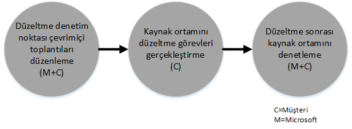

# Azure Active Directory Premium i&#231;in FastTrack Center Avantaj İşlemi 
Kuruluşunuz Microsoft Azure AD Premium için FastTrack Center Avantajı’na uygunsa, Microsoft Azure AD Premium ortamınızı kullanıma hazır hale getirmek için Microsoft uzmanlarıyla uzaktan çalışabilirsiniz. Kuruluşunuzun uygun olup olmadığını öğrenmek için bkz. [Azure Active Directory Premium için FastTrack Center Avantajı](../Topic/FastTrack_Center_Benefit_for_Azure_Active_Directory_Premium.md).

Bu makalede aşağıdakiler sağlanmaktadır:

-   [Overview of the onboarding process](#overview)

-   [Expectations for your source environment](#expectations_src_environ)

-   [Phases of the onboarding process](#phases_onboarding_process)

-   her aşamada [Microsoft responsibilities](#microsoft_responsibilities)

-   her aşamada [Your responsibilities](#your_responsibilities)

Onboarding tamamlandığı zaman şunların gerçekleşmesini bekleyebilirsiniz:

-   Microsoft Azure AD Premium kiracınız oluşturuldu.

-   Lisanslı kullanıcılar Microsoft Azure AD Premium hizmetine aşağıdaki kimlik seçeneklerinden birini kullanarak erişebilir:

    -   Bulut Kimlikleri (benzersiz Microsoft Azure AD Premium hesapları).

    -   Eşitlenen Kimlikler: Microsoft Azure AD Premium hesapları, tek bir ormana veya birden çok Active Directory ormanına sahip müşteriler için Azure Active Directory Connect (Azure AD Connect) aracıyla şirket içi Active Directory'nizden eşitlenir.

    -   Microsoft Azure AD Premium hesaplarına sahip aşağıdaki Federasyon Kimlikleri:

        -   Tek bir Active Directory ormanı yapılandırmasına sahip müşteriler için Microsoft Azure AD Connect aracıyla Active Directory’den eşitlenenler.

        -   Şirket içi Active Directory’nizden Active Directory Federasyon Hizmetleri (AD FS) 2.0 veya sonraki sürümüyle federasyona eklenenler.

## Onboarding işlemine genel bakış
Onboarding’in iki önemli bileşeni vardır:

-   **Çekirdek özellikler** - Kiracı yapılandırması ve gerektiğinde Azure AD ile tümleştirme için gereken görevler. Çekirdek özellikler, diğer uygun Microsoft Online hizmetlerinin hazırlanması için de temel sağlar.

-   **Hizmet hazırlama**: Microsoft Azure AD Premium’u tek başına veya Azure AD Connect dizin eşitleme ya da AD FS ile yapılandırmak için gerekli görevler.

Aşağıdaki diyagramda, FastTrack Center avantajının kullanılmasıyla ilgili zaman çizelgesi açıklanmaktadır.

Temel işlem aşağıdaki gibidir:

-   Microsoft, uygun bir plan satın aldığınız tarihten itibaren 30 gün içinde sizinle iletişim kuracaktır. Kuruluşunuzda bu hizmetleri dağıtmak için hazırsanız [FastTrack Center](http://fasttrack.microsoft.com/)’dan da yardım isteğinde bulunabilirsiniz. Yardım isteğinde bulunmak için, FastTrack Center’da (http://fasttrack.microsoft.com) oturum açın, panoya gidin, şirket adınızı seçin, Teklifler sekmesine tıklayın ve ilgili hizmet için yardım isteği düğmesine tıklayın. Onboarding desteği başlatıldıktan sonra, çevrimiçi toplantılar için planlama yaparız.

-   Microsoft ekibi, size çekirdek özellikler konusunda yardımcı olur ve ardından her uygun hizmet için bir kez olmak üzere hazırlanmanıza yardım eder.

Onboarding desteğinin tamamı atanan Microsoft personeli tarafından uzaktan sağlanacaktır:

-   Microsoft; araçların, belgelerin ve rehberliğin bir birleşimini kullanarak çeşitli onboarding etkinliklerinde sizi uzaktan destekler. Microsoft’un bazı yapılandırma görevlerini sizin yerinize gerçekleştirmesini istiyorsanız, bu görevleri gerçekleştirmesi için Microsoft'a uygun erişim ve izinleri sağlamayı tercih edebilirsiniz.

-   Hazırlama desteği, FastTrack Merkezi tarafından belirli bir bölgedeki normal çalışma saatleri içinde sağlanır.

-   Onboarding desteği Geleneksel Çince, İngilizce, Fransızca, Almanca, İtalyanca, Japonca, Portekizce (Brezilya) veya İspanyolca sunulmaktadır.

-   Microsoft ekibi doğrudan sizinle veya temsilcinizle çalışabilir.

## Kaynak ortamınız için beklentiler
Zengin kimlik yönetimi olanaklarına tek bir konsoldan erişmek için Microsoft Azure AD ile tümleştirmek istediğiniz şirket içi kaynak ortamınızda Microsoft Active Directory zaten mevcut olabilir. FastTrack Center avantajı, mevcut şirket içi uygulamanızı Microsoft Azure AD Premium ile tümleştirmenize yardımcı olmaya yönelik özellikler içerir. Tümleştirme gerekiyorsa, kaynak ortamınız bu uygulama için gerekli en düşük düzeyde olmalıdır.

Aşağıdaki tabloda, onboarding için mevcut kaynak ortamınızla ilgili beklentiler gösterilmektedir.

|Etkinlik|Kaynak ortamı beklentisi|
|------------|----------------------------|
|Çekirdek özellikler|Aşağıdaki orman yapılandırmalarına sahip, işlevsel orman düzeyi Windows Server 2008 veya üzeri için ayarlanan Active Directory ormanları:  -   Tek Active Directory ormanı -   Çoklu Active Directory ormanları **Note:** Tüm çok ormanlı yapılandırmalarda, AD FS dağıtımı FastTrack Center Avantajı’nın kapsamı dışındadır.|
|Hizmet onboarding işlemi  -   Microsoft Azure AD Premium|Şirket içi Active Directory ve ortam, Azure AD ile tümleştirmeye hazırlandı (Azure AD ve Azure AD Premium özellikleri ile tümleştirmeyi önleyen bilinen sorunları düzeltmeyi içerir).|

## Onboarding işleminin aşamaları
Microsoft Azure AD Premium için hazırlanma, aşağıdaki resimde gösterildiği gibi beş birincil aşamaya sahiptir:

-   Başlat

-   Değerlendirme

-   Düzeltme

-   Etkinleştir

-   Kapat

Her aşamayla ilgili ayrıntılı görevler için, [Microsoft responsibilities](#microsoft_responsibilities) ve [Your responsibilities](#your_responsibilities) bölümlerine bakın.

### Başlatma aşaması
Uygun sayıda lisans satın aldıktan sonra, satın alma onayı e-postasındaki yönergeleri takip ederek lisansları mevcut veya yeni kiracınızla ilişkilendirin. Microsoft, FastTrack Center Avantajı için uygunluk durumunuzu doğrular. Microsoft, uygun bir plan satın aldığınız tarihten itibaren 30 gün içinde sizinle iletişim kuracaktır. Kuruluşunuzda bu hizmetleri dağıtmak için hazırsanız [FastTrack Center](http://fasttrack.microsoft.com/)’dan da yardım isteğinde bulunabilirsiniz. Yardım isteğinde bulunmak için, FastTrack Center’da (http://fasttrack.microsoft.com) oturum açın, panoya gidin, şirket adınızı seçin, Teklifler sekmesine tıklayın ve ilgili hizmet için yardım isteği düğmesine tıklayın. Onboarding desteği başlatıldıktan sonra, çevrimiçi toplantılar için planlama yaparız.

Bu aşamada onboarding işlemini tartışır, verileri doğrular ve bir başlangıç toplantısı ayarlarız.

### Değerlendirme aşaması
Onboarding işlemi başladıktan sonra, Microsoft kaynak ortamınızın ve gereksinimlerin değerlendirilmesi için sizinle birlikte çalışır. Araçlar kullanılarak ortamınız değerlendirilir ve hazırlanma için herhangi bir değişikliğe ihtiyaç olup olmadığını belirlemek üzere şirket içi Active Directory’niz, İnternet tarayıcılarınız, istemci cihazlarınızın işletim sistemleri, DNS, ağ, altyapı ve kimlik sistemi değerlendirmesinde Microsoft size rehberlik sağlar. Mevcut kurulumunuzu temel alarak, Microsoft Azure AD Premium’a başarıyla hazırlanmanız için kaynak ortamınızı en düşük gereksinimlere getirecek bir düzeltme planı sağlarız. Aynı zamanda düzeltme aşaması için uygun denetim noktası aramaları da ayarlarız.

### Düzeltme aşaması
Gerekli olursa, her hizmetin eklenmesi için en düşük gereksinimleri karşılamak üzere, düzeltme planındaki görevleri kaynak ortamınızda siz gerçekleştirirsiniz.

Etkinleştirme aşamasına başlamadan önce, devam etmeye hazır olduğunuzdan emin olmak için düzeltme etkinliklerinin sonuçlarını ortaklaşa doğrularız.

### Etkinleştirme aşaması
Tüm düzeltme etkinlikleri tamamlandığı zaman, proje, çekirdek altyapının hizmet tüketimi ve Microsoft Azure AD Premium’un hazırlanması için çekirdek yapılandırmasına geçer.

**Etkinleştirme aşaması - Çekirdek özellikler**

Çekirdek özellikleri etkinleştirme işlemi, hizmetin sağlanması ile kiracı ve kimlik tümleştirmesini kapsar. Aynı zamanda Microsoft Azure AD Premium’a hazırlanma için bir temel sağlayacak adımları da içerir.

Microsoft Azure AD Premium için hazırlanma, çekirdek hazırlanma işlemi tamamlandığında başlayabilir.

**Etkinleştirme aşaması – Microsoft Azure AD Premium**

Microsoft Azure AD Premium ortamı, gerektiğinde Azure AD Connect dizin eşitlemesi ve Active Directory Federasyon Hizmetleri (AD FS) ile ayarlanabilir.

Şirket içi kimlikleri bulutla eşitlemeyi içeren Microsoft Azure AD Premium senaryolarında, aboneliğinize BT yöneticileri ve kullanıcılar ekleme, yönetim önkoşullarını yapılandırma, Microsoft Azure AD Premium’u ayarlama, Azure AD Connect’i kullanarak dizin eşitlemeyi ve Active Directory Federasyon Hizmetleri’ni ayarlama, test kullanıcılarını yapılandırma ve hizmet için çekirdek kullanım örneklerinizi doğrulama işlemlerini gerçekleştirerek size yardımcı olacağız.

Microsoft Azure AD Premium kurulumu, aşağıdaki özelliklerin etkinleştirilmesini içerir:

-   Self Servis Parola Sıfırlama (SSPR)

-   Azure Çok Faktörlü Kimlik Doğrulaması (MFA)

-   Hizmet Olarak Yazılım (SaaS) uygulaması - bir SaaS uygulaması ayarlama

-   Self Servis Grup Yönetimi (SSGM)

-   Yönetim raporları

## Microsoft sorumlulukları

### Genel

-   Ayrıntılı aşama açıklamalarında açıklanan şekilde, gerekli yapılandırma etkinlikleri için size uzaktan destek yardımı sağlarız.

-   Yapılandırma görevlerini azaltmanıza ve ortadan kaldırmanıza yardımcı olmak için mevcut belgeler ve yazılım araçları, yönetici konsolları ve betikleri sağlarız.

FastTrack Center avantajını kullanmak için Microsoft’a erişim ve izin sağlanması gerekmez. Bazı durumlarda, Microsoft’un belirli etkinlikleri sizin adınıza gerçekleştirmesi için Microsoft’a uygun erişim ve izinleri vermeyi tercih edebilirsiniz.

### Başlatma aşaması

-   Yeni bir kiracı için uygun lisansları satın almanızdan sonraki 30 gün içinde sizinle iletişime geçme.

-   Uygun lisansların satın alınmasından sonraki 90 gün içinde onboarding işlemine başlamak için sizinle çalışma.

-   Onboarding için hangi uygun hizmetleri istediğinizi tanımlama.

### Değerlendirme aşaması

-   Yönetimsel bir genel bakış sağlama.

-   Şu konularda rehberlik sağlarız:

    -   DNS, ağ ve altyapı ihtiyaçları.

    -   İstemci ihtiyaçları (Internet tarayıcısı, istemci işletim sistemi ve hizmetlerle ilgili ihtiyaçlar).

    -   Kullanıcı kimliği ve hazırlama.

    -   Dizin Eşitleme Gereksinimlerini tanımlama.

    -   Parola karma eşitlemesinin müşterinin amaçlarını karşılayıp karşılamadığını veya AD FS’nin gerekli olup olmadığını belirleme.

    -   Satın alınan ve onboarding işleminin bir parçası olarak tanımlanan uygun hizmetleri etkinleştirme.

    -   Test hesapları, SaaS uygulamasının test örneği (örneğin, SalesForce) gibi gerekli pilot uygulaması ve test ortamı gereksinimlerini tanımlama.

-   Düzeltme etkinlikleri için zaman çizelgesi oluşturma.

-   Düzeltme denetim listesi sağlama.

### Düzeltme aşaması

-   Düzeltme etkinliklerinin ilerlemesini gözden geçirmek için üzerinde anlaşılan zaman çizelgesine göre konferans aramaları düzenleme.

-   Sorunları tanımlamak ve düzeltmek için araçlar çalıştırarak ve sonuçları yorumlayarak destek sağlama.

### Etkinleştirme aşaması
Şu konularda rehberlik sağlarız:

-   Microsoft Azure AD Premium kiracınızı etkinleştirme.

-   Güvenlik duvarı bağlantı noktalarını yapılandırma.

-   Uygun hizmetler için DNS’i yapılandırma.

-   Microsoft Azure AD Premium hizmetlerine bağlantıyı doğrulama.

-   Tek orman ortamı için:

    -   Gerekli olursa, Active Directory Etki Alanı Hizmetleri’niz (AD DS) ve Azure AD Connect arasında dizin eşitlemesi yükleme.

    -   Azure AD Connect aracı ile parola eşitlemesini yapılandırma.

-   Çok ormanlı bir ortam için:

    -   Azure AD Connect eşitlemesi yükleyin, birden çok ormanlı senaryolar için ayarlayın. Parola karma eşitlemesi ve parola geri yazmanın birden çok ormanı desteklediğini unutmayın.  Ancak, diğer geri yazma senaryoları desteklenmez.

    -   Şirket içi Active Directory ormanları ve Microsoft Azure AD Premium dizini (Azure Active Directory) arasında eşitlemeyi yapılandırın.

        > [!NOTE]
        > Özel kurallar uzantıları için geliştirme ve uygulama işlemleri kapsam dışındadır.

-   Federasyon kimlikleri hedeflendiğinde tek orman için: Gerekli olursa, tek sitede, hataya dayanıklı bir yapılandırmada yerel etki alanı kimlik doğrulaması için Microsoft Azure AD Premium ile Active Directory Federasyon Hizmetleri’ni (AD FS) yükleme ve yapılandırma.

    > [!NOTE]
    > Çoklu orman yapılandırmalarında, AD FS dağıtımları kapsam dışındadır.

-   Dağıtılmışsa, çoklu oturum açma (SSO) işlevselliğini test etme.

#### Etkinleştirme aşaması - Azure AD Premium: Azure AD Connect ve AD FS ile
Şunları ayarlama hakkında rehberlik sağlar:

-   Lisanslama dahil olmak üzere kullanıcı hazırlama

-   Azure AD Connect dizin eşitlemesi (parola geri yazma ve parola karma eşitlemesi ile).

-   Active Directory Federasyon Hizmetleri (AD FS).

-   Self Servis Parola Sıfırlama (SSPR).

-   Azure Multi-factor Authentication (MFA).

-   SaaS uygulamaları için Çoklu Oturum Açma’yı içerebilen bir tümleşik uygulama.

-   Yöneticilere kullanım ve güvenlik raporları.

-   Sef Servis Grup Yönetimi (SSGM).

-   Uygulama proxy’si.

-   Yönetici bildirimleri.

-   Logo, metin ve görüntüler dahil olmak üzere özelleştirilmiş oturum açma ekranı.

## Sizin Sorumluluklarınız
Bu bölümde onboarding işlemi sırasında sizin yükümlülüklerinizin bazıları açıklanmaktadır.

### Genel

-   Yapılandırılabilir seçeneklerin dışında Microsoft Azure AD Premium kiracınız için yapılabilecek tüm geliştirmeler ve tümleştirmeler bu makalede listelenmektedir.

-   Kaynaklarınızın genel program ve proje yönetimi.

-   Son kullanıcı iletişimleri, belgeler, eğitim ve değişiklik yönetimi.

-   Yardım Masası belgeleri ve eğitimi.

-   Kuruluşunuza özel tüm raporların, sunumların veya toplantı notlarının oluşturulması.

-   Kuruluşunuza özel mimari ve teknik belgeleri oluşturma.

-   Donanımın ve ağ tasarlama, temin etme, yükleme ve yapılandırma.

-   Yazılımı temin etme, yükleme ve yapılandırma.

-   Microsoft Azure AD Premium hizmetlerinizin taban çizgisi yapılandırmasını ve işlevselliğini test etmek için oluşturulanların dışındaki güvenlik ilkelerini yönetin, yapılandırın ve uygulayın.

-   Microsoft Azure AD Premium hizmetlerinin taban çizgisi yapılandırmasını ve işlevselliğini test etmek için kullanılanların dışındaki kullanıcı hesaplarını kaydetme.

-   Ağ yapılandırması, analiz, bant genişliği doğrulama, test ve izleme.

-   Teknik değişiklik yönetimi onay işlemini yönetme ve destekleyici belgeler oluşturma.

-   İşlem modelini ve işlem kılavuzlarını değiştirme.

-   Şirket içi çok öğeli kimlik doğrulamayı ayarlama.

-   Daha önce müşteri tarafından kullanılan kaynak ortamların ve hizmetlerin yetkisini kaldırma ve bunları kaldırma.

-   Test ortamınızı oluşturma ve bakımını yapma.

-   Altyapı sunucularına hizmet paketlerini ve diğer gerekli güncelleştirmeleri yükleme.

-   Genel SSL sertifikalarını sağlama ve yapılandırma.

-   Kurumun yapılandırılacak ve son kullanıcılara ait cihazlarda görüntülenecek Kullanım Koşulları (TOU) bildirimini yazma.

### Başlatma aşaması

-   Uygun hizmetlerin eklenmesi işlemine başlamak için Microsoft ekibi ile çalışma.

-   İşin başlangıç toplantısına katılın, kuruluşunuzun katılımcılarını yönetin ve onlara liderlik edin ve düzeltme zaman çizelgelerini onaylayın.

### Değerlendirme aşaması

-   Gerekli değerlendirme etkinliklerini tamamlamak için uygun paydaşları (bir proje yöneticisi dahil) belirleyin.

-   İsterseniz, değerlendirme araçlarını ortamınızda veya Microsoft Azure AD Premium aboneliğinizde çalıştırırken yardıma ihtiyaç duymanız durumunda ekranınızı Microsoft ile paylaşabilirsiniz.

-   Altyapı, ağ, yönetim, dizin eşitleme hazırlığı, ağ güvenliği ve federasyon kimliği başlıkları dahil olmak üzere, düzeltme denetim listesini oluşturmak ve genel plana katkı sunmak için toplantılara katılın.

-   Kullanıcı hazırlama yaklaşımının ana hatlarını belirlemek için toplantılara katılın.

-   Çevrimiçi hizmet yapılandırmasını planlamak için toplantılara katılın.

-   Geçiş hazırlığı için bir destek planı oluşturun.

### Düzeltme aşaması

-   Değerlendirme aşamasında tanımlanan düzeltme etkinliklerini tamamlamak için gerekli adımları uygulayın.

-   Denetim noktası toplantılarına katılın.

### Etkinleştirme aşaması

-   İsterseniz, ortamınızda veya Microsoft Azure AD Premium aboneliğinizde değişiklikler yaparken rehberliğe ihtiyaç duyduğunuzda ekranınızı Microsoft ile paylaşın.

-   Kaynakları uygun şekilde yönetin.

-   Ağ ile ilişkili öğeleri Microsoft rehberliğine göre yapılandırın.

-   Microsoft rehberliğinde dizin hazırlığı yapın ve dizin eşitlemesini yapılandırın.

-   Microsoft rehberliğinde güvenlikle ilişkili altyapıyı (güvenlik duvarı bağlantı noktaları gibi) yapılandırın.

-   Uygun istemci altyapısını uygulayın.

-   Microsoft rehberliğinde bir kullanıcı hazırlama yaklaşımını uygulayın.

-   Microsoft rehberliğinde çeşitli hizmetleri etkinleştirin.

## Daha fazla bilgi almak ister misiniz?
Bkz. [Microsoft Azure Active Directory](http://azure.microsoft.com/en-us/documentation/services/active-directory/) ve [Enterprise Mobility Suite](http://www.microsoft.com/en-us/server-cloud/products/enterprise-mobility-suite/default.aspx).

