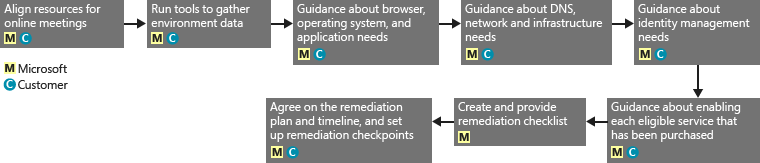

# Azure Hak Y&#246;netimi i&#231;in FastTrack Center Avantajı İşlemi
Kuruluşunuz Microsoft Azure Hak Yönetimi için FastTrack Center Avantajı’na uygunsa, Microsoft Azure RMS ortamınızı kullanıma hazır hale getirmek için Microsoft uzmanlarıyla uzaktan çalışabilirsiniz. Kuruluşunuzun uygun olup olmadığını öğrenmek için, bkz. [Azure Hak Yönetimi için FastTrack Center Avantajı](../Topic/FastTrack_Center_Benefit_for_Azure_Rights_Management.md).

Bu makalede aşağıdakiler sağlanmaktadır:

-   [Overview of the onboarding process](#overview_rms)

-   [Expectations for your source environment](#expectations_src_environ_rms)

-   [Phases of the onboarding process](#phases_onboarding_process_rms)

-   her aşama için [Microsoft responsibilities](#microsoft_responsibilities_rms)

-   her aşama için [Your responsibilities](#your_responsibilities_rms)

Onboarding tamamlandığı zaman şunların gerçekleşmesini bekleyebilirsiniz:

-   Microsoft Azure RMS kiracınız oluşturulur.

-   Lisanslı kullanıcılar, Azure RMS hizmetine aşağıdaki kimlik seçeneklerinden birini kullanarak erişebilir:

    -   Bulut Kimlikleri (benzersiz Microsoft Azure AD hesapları).

    -   Eşitlenen Kimlikler: Tek bir ormana veya birden çok Active Directory ormanına sahip müşteriler için Azure Active Directory Connect (Azure AD Connect) aracıyla şirket içi Active Directory'nizden eşitlenen Microsoft Azure AD hesapları.

    -   Microsoft Azure AD hesaplarına sahip aşağıdaki Federasyon Kimlikleri:

        -   Tek bir Active Directory ormanı yapılandırmasına sahip müşteriler için Microsoft Azure AD Connect aracıyla Active Directory’den eşitlenenler.

        -   Şirket içi Active Directory’nizden Active Directory Federasyon Hizmetleri (AD FS) 2.0 veya sonraki sürümüyle federasyona eklenenler.

## Onboarding işlemine genel bakış
Onboarding’in iki önemli bileşeni vardır:

-   **Çekirdek özellikler** - Kiracı yapılandırması ve gerektiğinde Azure AD ile tümleştirme için gereken görevler. Çekirdek özellikler, diğer uygun Microsoft Online hizmetlerinin hazırlanması için de temel sağlar.

-   **Hizmet hazırlama**: Azure RMS’yi tek başına yapılandırmak veya Azure AD Connect dizin eşitleme ya da AD FS ile yapılandırmak için gerekli görevler.

Aşağıdaki diyagramda, FastTrack Center avantajının kullanılmasıyla ilgili zaman çizelgesi açıklanmaktadır.

Temel işlem aşağıdaki gibidir:

-   Microsoft, uygun bir plan satın aldığınız tarihten itibaren 30 gün içinde sizinle iletişim kuracaktır. Kuruluşunuzda bu hizmetleri dağıtmak için hazırsanız [FastTrack Center](http://fasttrack.microsoft.com/)’dan da yardım isteğinde bulunabilirsiniz. Yardım isteğinde bulunmak için, FastTrack Center’da (http://fasttrack.microsoft.com) oturum açın, panoya gidin, şirket adınızı seçin, Teklifler sekmesine tıklayın ve ilgili hizmet için yardım isteği düğmesine tıklayın.

-   Microsoft ekibi, size çekirdek özellikler konusunda yardımcı olur ve ardından her uygun hizmet için bir kez olmak üzere hazırlanmanıza yardım eder.

Onboarding desteğinin tamamı atanan Microsoft personeli tarafından uzaktan sağlanacaktır:

-   Microsoft; araçların, belgelerin ve rehberliğin bir birleşimini kullanarak çeşitli onboarding etkinliklerinde sizi uzaktan destekler. Microsoft’un bazı yapılandırma görevlerini sizin yerinize gerçekleştirmesini istiyorsanız, bu görevleri gerçekleştirmesi için Microsoft'a uygun erişim ve izinleri sağlamayı tercih edebilirsiniz.

-   Hazırlama desteği, FastTrack Merkezi tarafından belirli bir bölgedeki normal çalışma saatleri içinde sağlanır.

-   Onboarding desteği Geleneksel Çince, İngilizce, Fransızca, Almanca, İtalyanca, Japonca, Portekizce (Brezilya) veya İspanyolca sunulmaktadır.

-   Microsoft ekibi, tercihinize bağlı olarak doğrudan sizinle veya temsilcinizle çalışabilir.

## Kaynak ortamınız için beklentiler
Zengin kimlik yönetimi olanaklarına tek bir konsoldan erişmek için Microsoft Azure Active Directory ile tümleştirmek istediğiniz şirket içi kaynak ortamınızda Microsoft Active Directory zaten mevcut olabilir. FastTrack Center avantajı, mevcut şirket içi uygulamanızı Microsoft Azure Active Directory ile tümleştirmenize yardımcı olmaya yönelik özellikler içerir. Tümleştirme gerekiyorsa, kaynak ortamınız bu uygulama için gerekli en düşük düzeyde olmalıdır.

Aşağıdaki tabloda, onboarding için mevcut kaynak ortamınızla ilgili beklentiler gösterilmektedir.

|Etkinlik|Kaynak ortamı beklentisi|
|------------|----------------------------|
|Çekirdek özellikler|Aşağıdaki orman yapılandırmalarına sahip, işlevsel orman düzeyi Windows Server 2008 veya üzeri için ayarlanan Active Directory ormanları:  -   Tek Active Directory ormanı -   Çoklu Active Directory ormanları **Note:** Tüm çok ormanlı yapılandırmalarda, AD FS dağıtımı FastTrack Center Avantajının kapsamı dışındadır.|
|Hizmet onboarding işlemi  -   Azure RMS|Şirket içi Active Directory ve ortam, Azure RMS ile tümleştirmeye hazırlandı (Azure AD ve Azure RMS özellikleri ile tümleştirmeyi önleyen bilinen sorunları düzeltmeyi içerir).|

## Onboarding işleminin aşamaları
Azure RMS hazırlama, aşağıdaki resimde gösterildiği gibi beş temel aşamadan oluşur:

-   Başlat

-   Değerlendirme

-   Düzeltme

-   Etkinleştir

-   Kapat

Her aşamayla ilgili ayrıntılı görevler için, [Microsoft responsibilities](#microsoft_responsibilities_rms) ve [Your responsibilities](#your_responsibilities_rms) bölümlerine bakın.

### Başlatma aşaması
Uygun sayıda lisans satın aldıktan sonra, satın alma onayı e-postasındaki yönergeleri takip ederek lisansları mevcut veya yeni kiracınızla ilişkilendirin. Microsoft, FastTrack Center Avantajı için uygunluğunuzu doğrular. Microsoft, uygun bir plan satın aldığınız tarihten itibaren 30 gün içinde sizinle iletişim kuracaktır. Kuruluşunuzda bu hizmetleri dağıtmak için hazırsanız [FastTrack Center](http://fasttrack.microsoft.com/)’dan da yardım isteğinde bulunabilirsiniz. Yardım isteğinde bulunmak için, FastTrack Center’da (http://fasttrack.microsoft.com) oturum açın, panoya gidin, şirket adınızı seçin, Teklifler sekmesine tıklayın ve ilgili hizmet için yardım isteği düğmesine tıklayın.

Bu aşamada onboarding işlemini tartışır, verileri doğrular ve bir başlangıç toplantısı ayarlarız.

### Değerlendirme aşaması
Onboarding işlemi başladıktan sonra, Microsoft kaynak ortamınızın ve gereksinimlerin değerlendirilmesi için sizinle birlikte çalışır. Araçlar kullanılarak ortamınız değerlendirilir ve hazırlanma için herhangi bir değişikliğe ihtiyaç olup olmadığını belirlemek üzere şirket içi Active Directory’niz, İnternet tarayıcılarınız, istemci cihazlarınızın işletim sistemleri, DNS, ağ, altyapı ve kimlik sistemi değerlendirmesinde Microsoft size rehberlik sağlar. Mevcut kurulumunuzu temel alarak, kaynak ortamınızı Azure RMS’yi başarıyla eklemeniz için en düşük gereksinimlere getirecek bir düzeltme planı sağlarız. Aynı zamanda düzeltme aşaması için uygun denetim noktası aramaları da ayarlarız.

### Düzeltme aşaması
Gerekli olursa, her hizmetin eklenmesi için en düşük gereksinimleri karşılamak üzere, düzeltme planındaki görevleri kaynak ortamınızda siz gerçekleştirirsiniz.

Etkinleştirme aşamasına başlamadan önce, devam etmeye hazır olduğunuzdan emin olmak için düzeltme etkinliklerinin sonuçlarını ortaklaşa doğrularız.

### Etkinleştirme aşaması
Tüm düzeltme etkinlikleri tamamlandığı zaman, proje, çekirdek altyapıyı hizmet tüketimi için yapılandırma ve Azure RMS’yi sağlama aşamasına geçer.

**Etkinleştirme aşaması - Çekirdek özellikler**

Çekirdek özellikleri etkinleştirme işlemi, hizmetin sağlanması ile kiracı ve kimlik tümleştirmesini kapsar. Aynı zamanda, Microsoft Azure RMS’yi hazırlama için temel sağlayacak adımları da içerir.

Azure RMS’yi hazırlama, çekirdek hazırlanma işlemi tamamlandığında başlayabilir.

**Etkinleştirme aşaması – Azure RMS**

Azure RMS ortamı, gerektiğinde Azure AD Connect dizin eşitlemesi ve Active Directory Federasyon Hizmetleri (AD FS) ile ayarlanabilir.

Şirket içi kimlikleri bulutla eşitlemeyi içeren Azure RMS senaryolarında, aboneliğinize BT yöneticileri ve kullanıcılar ekleme, yönetim önkoşullarını yapılandırma, Azure RMS’yi ayarlama, Azure AD Connect’i kullanarak dizin eşitlemeyi ve Active Directory Federasyon Hizmetleri’ni ayarlama, test kullanıcılarını yapılandırma ve hizmet için çekirdek kullanım örneklerinizi doğrulama işlemlerini gerçekleştirerek size yardımcı olacağız.

Azure RMS kurulumu, aşağıdaki özelliklerin etkinleştirilmesini içerir:

-   RMS Hizmetini Etkinleştirme

-   Exchange Online ve Sharepoint Online için IRM Yapılandırması

-   Şirket içi Exchange ve şirket içi Sharepoint ile Hak Yönetimi Bağlayıcısı

-   Windows ve Windows dışı cihazlar için RMS Paylaşım Uygulaması

## Microsoft sorumlulukları

### Genel

-   Ayrıntılı aşama açıklamalarında açıklanan şekilde, gerekli yapılandırma etkinlikleri için size uzaktan destek yardımı sağlarız.

-   Yapılandırma görevlerini azaltmanıza ve ortadan kaldırmanıza yardımcı olmak için mevcut belgeler ve yazılım araçları, yönetici konsolları ve betikleri sağlarız.

FastTrack Center avantajını kullanmak için Microsoft’a erişim ve izin sağlanması gerekmez. Bazı durumlarda, Microsoft’un belirli etkinlikleri sizin adınıza gerçekleştirmesi için Microsoft’a uygun erişim ve izinleri vermeyi tercih edebilirsiniz.

### Başlatma aşaması

-   Yeni bir kiracı için uygun lisansları satın almanızdan sonraki 30 gün içinde sizinle iletişime geçme.

-   Onboarding için hangi uygun hizmetleri istediğinizi tanımlama.

### Değerlendirme aşaması

-   Yönetimsel bir genel bakış sağlama.

-   Şu konularda rehberlik sağlarız:

    -   DNS, ağ ve altyapı ihtiyaçları.

    -   İstemci ihtiyaçları (Internet tarayıcısı, istemci işletim sistemi ve hizmetlerle ilgili ihtiyaçlar).

    -   Kullanıcı kimliği ve hazırlama.

    -   Dizin Eşitleme Gereksinimlerini tanımlama.

    -   Satın alınan ve hazırlama işleminin bir parçası olarak tanımlanan uygun hizmetlerin etkinleştirilmesi.

    -   Gerekli pilot uygulamaları ve test ortamı gereksinimlerini belirleme.

-   Düzeltme etkinlikleri için zaman çizelgesi oluşturma.

-   Düzeltme denetim listesi sağlama.

### Düzeltme aşaması

-   Düzeltme etkinliklerinin ilerlemesini gözden geçirmek için üzerinde anlaşılan zaman çizelgesine göre konferans aramaları düzenleme.

-   Sorunları tanımlamak ve düzeltmek için araçlar çalıştırarak ve sonuçları yorumlayarak destek sağlama.

### Etkinleştirme aşaması
Şu konularda rehberlik sağlarız:

-   Azure RMS kiracınızı etkinleştirme.

-   Güvenlik duvarı bağlantı noktalarını yapılandırma.

-   Uygun hizmetler için DNS’i yapılandırma.

-   Azure RMS hizmetlerine bağlantıyı doğrulama.

-   Tek orman ortamı için:

    -   Gerekli olursa, Active Directory Etki Alanı Hizmetleri’niz (AD DS) ve Azure AD Connect arasında dizin eşitlemesi yükleme.

    -   Azure AD Connect aracı ile parola eşitlemesini yapılandırma.

-   Çok ormanlı bir ortam için:

    -   Azure AD Connect eşitlemesi yükleme ve birden çok ormanlı senaryolar için ayarlama. Parola karma eşitlemesi ve parola geri yazmanın birden çok ormanı desteklediğini unutmayın.  Ancak, diğer geri yazma senaryoları desteklenmez.

    -   Şirket içi Active Directory ormanları ve Microsoft Azure AD dizini (Azure Active Directory) arasında eşitlemeyi yapılandırın.

        > [!NOTE]
        > Özel kurallar uzantıları için geliştirme ve uygulama işlemleri kapsam dışındadır.

-   Federasyon kimlikleri hedeflendiğinde tek orman için: Gerekli olursa, tek sitede, hataya dayanıklı bir yapılandırmada yerel etki alanı kimlik doğrulaması için Microsoft Azure AD ile Active Directory Federasyon Hizmetleri’ni (AD FS) yükleme ve yapılandırma.

    > [!NOTE]
    > Çoklu orman yapılandırmalarında, AD FS dağıtımları kapsam dışındadır.

-   Dağıtılmışsa, çoklu oturum açma (SSO) işlevselliğini test etme.

-   Şablonları yönetmek için bilgi güvenliği yöneticileri ekleme.

-   Azure RMS’ye süper kullanıcı hesabı atama.

-   Azure RMS için iki pilot kullanıcı lisanslama.

-   İlkeleri doğrulamak için iki test dağıtım grubu yapılandırma.

-   Dizininiz için özel bir Azure RMS şablonu yapılandırma.

-   SharePoint Online ve Exchange Online ile Azure RMS tümleştirmesinin ayarlanması için şu konularda rehberlik sağlama:

    -   Exchange Online ile Azure RMS tümleştirmesini yapılandırma ve doğrulama.

    -   Kuruluşunuz dışındaki alıcılara gönderilen hassas iletileri şifrelemek için test postası akış kuralı ayarlama.

    -   Azure RMS ile korunmak için bir test Kitaplığının SharePoint Online korumasını yapılandırma ve doğrulama.

-   Gerekli olduğunda bir şirket içi sunucu RMS Bağlayıcısı ile yapılandırma:

    -   Şirket içi Exchange 2013/2010 ile Azure RMS tümleştirmesini yapılandırma ve doğrulama.

    -   Bağlayıcı’yı kullanarak, kuruluşunuz dışındaki alıcılara gönderilen hassas iletileri şifrelemek için test postası akış kuralı ayarlama.

    -   Azure RMS ile korunmak için bir test Kitaplığının şirket içi SharePoint 2013/2010 korumasını Yapılandırma ve Doğrulama.

-   Windows ve Windows dışı cihazlar için RMS Paylaşım Uygulamasını ayarlama.

## Sizin Sorumluluklarınız
Bu bölümde onboarding işlemi sırasında sizin yükümlülüklerinizin bazıları açıklanmaktadır.

### Genel

-   Azure RMS kiracınız için yapılandırılabilir seçeneklerin dışındaki tüm geliştirme ve tümleştirmeler bu makalede listelenmektedir.

-   Kaynaklarınızın genel program ve proje yönetimi.

-   Son kullanıcı iletişimleri, belgeler, eğitim ve değişiklik yönetimi.

-   Yardım Masası belgeleri ve eğitimi.

-   Kuruluşunuza özel tüm raporların, sunumların veya toplantı notlarının oluşturulması.

-   Kuruluşunuza özel mimari ve teknik belgeleri oluşturma.

-   Donanımın ve ağ tasarlama, temin etme, yükleme ve yapılandırma.

-   Yazılımı temin etme, yükleme ve yapılandırma.

-   Azure RMS hizmetlerinizin taban çizgisi yapılandırmasını ve işlevselliğini test etmek için oluşturulanların dışındaki güvenlik ilkelerini yönetme, yapılandırma ve uygulama.

-   Azure RMS hizmetlerinin taban çizgisi yapılandırmasını ve işlevselliğini test etmek için kullanılanların dışındaki kullanıcı hesaplarını kaydetme.

-   Ağ yapılandırması, analiz, bant genişliği doğrulama, test ve izleme.

-   Teknik değişiklik yönetimi onay işlemini yönetme ve destekleyici belgeler oluşturma.

-   İşlem modelini ve işlem kılavuzlarını değiştirme.

-   Daha önce müşteri tarafından kullanılan kaynak ortamların ve hizmetlerin yetkisini kaldırma ve bunları kaldırma.

-   Test ortamınızı oluşturma ve bakımını yapma.

-   Altyapı sunucularına hizmet paketlerini ve diğer gerekli güncelleştirmeleri yükleme.

-   Genel SSL sertifikalarını sağlama ve yapılandırma.

-   Kurumun yapılandırılacak ve son kullanıcılara ait cihazlarda görüntülenecek Kullanım Koşulları (TOU) bildirimini yazma.

### Başlatma aşaması

-   Uygun hizmetlerin eklenmesi işlemine başlamak için Microsoft ekibi ile çalışma.

-   İşin başlangıç toplantısına katılın, kuruluşunuzun katılımcılarını yönetin ve onlara liderlik edin ve düzeltme zaman çizelgelerini onaylayın.

### Değerlendirme aşaması

-   Gerekli değerlendirme etkinliklerini tamamlamak için uygun paydaşları (bir proje yöneticisi dahil) belirleyin.

-   İsterseniz, değerlendirme araçlarını ortamınızda veya Azure RMS aboneliğinizde çalıştırırken yardıma ihtiyaç duymanız durumunda ekranınızı Microsoft ile paylaşabilirsiniz.

-   Altyapı, ağ, yönetim, dizin eşitleme hazırlığı, ağ güvenliği ve federasyon kimliği başlıkları dahil olmak üzere, düzeltme denetim listesini oluşturmak ve genel plana katkı sunmak için toplantılara katılın.

-   Kullanıcı hazırlama yaklaşımının ana hatlarını belirlemek için toplantılara katılın.

-   Çevrimiçi hizmet yapılandırmasını planlamak için toplantılara katılın.

-   Geçiş hazırlığı için bir destek planı oluşturun.

### Düzeltme aşaması

-   Değerlendirme aşamasında tanımlanan düzeltme etkinliklerini tamamlamak için gerekli adımları uygulayın.

-   Denetim noktası toplantılarına katılın.

### Etkinleştirme aşaması

-   İsterseniz, ortamınızda veya Azure RMS aboneliğinizde değişiklik yaparken rehberliğe ihtiyaç duymanız durumunda ekranınızı Microsoft ile paylaşabilirsiniz.

-   Kaynakları uygun şekilde yönetin.

-   Ağ ile ilişkili öğeleri Microsoft rehberliğine göre yapılandırın.

-   Microsoft rehberliğinde dizin hazırlığı yapın ve dizin eşitlemesini yapılandırın.

-   Microsoft rehberliğinde güvenlikle ilişkili altyapıyı (güvenlik duvarı bağlantı noktaları gibi) yapılandırın.

-   Uygun istemci altyapısını uygulayın.

-   Microsoft rehberliğinde bir kullanıcı hazırlama yaklaşımını uygulayın.

-   Microsoft rehberliğinde çeşitli hizmetleri etkinleştirin.

## Daha fazla bilgi almak ister misiniz?
Bkz. [Microsoft Azure Hak Yönetimi](http://products.office.com/business/microsoft-azure-rights-management) ve [Enterprise Mobility Suite](http://www.microsoft.com/en-us/server-cloud/products/enterprise-mobility-suite/default.aspx).

