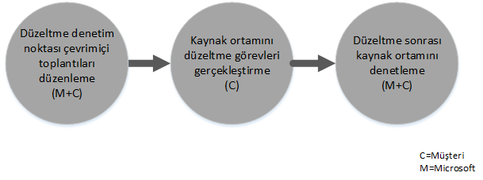

# Intune i&#231;in FastTrack Center Avantaj İşlemi
Kuruluşunuz Microsoft Intune hizmet avantajı için uygunsa, Microsoft Intune ortamınızı kullanıma hazır hale getirmek için Microsoft uzmanlarıyla uzaktan çalışabilirsiniz.

Microsoft Intune, Microsoft tarafından sağlanan ve Mobil Cihaz Yönetimi (MDM), Mobil Uygulama Yönetimi (MAM) gibi Kurumsal Mobilite Yönetimi (EMM) özellikleri sunan Enterprise Mobility Suite (EMS) ürününün bir parçasıdır.  Microsoft Intune sayesinde cihazları sağlayarak, cihazları yapılandırarak ve mobil uygulamaları dağıtarak çalışanlarınızın mobil cihazlarda üretken olmasını sağlayabilirsiniz.  Ayrıca, cihaz uyumluluğunu izleme, mobil uygulamaları ve verileri koruma, kurumsal hizmetlere erişimi denetlemek için bunları Azure AD ile tümleştirme olanakları sayesinde Microsoft Intune’u kurumsal verilerinizi korumak amacıyla da kullanabilirsiniz.

Kuruluşunuzun uygun olup olmadığını öğrenmek için bkz. [Intune için FastTrack Center Avantajı](../Topic/FastTrack_Center_Benefit_for_Intune.md). Ortamınızı diğer Enterprise Mobility Suite hizmetlerine hazır hale getirmek istiyorsanız bkz. [Enterprise Mobility Suite için FastTrack Center](../Topic/FastTrack_Center_Benefit_for_Enterprise_Mobility_Suite.md).

**Office 365 için Microsoft FastTrack hakkında bilgi edinmek mi istiyorsunuz? Bkz.** [Office 365 için FastTrack Center Avantajı](https://technet.microsoft.com/library/office-365-onboarding-benefit.aspx).

Bu makalede, Microsoft Intune için servis avantajı ile ilgili aşağıdaki bilgiler sağlanmaktadır:

-   [Overview of the onboarding process](#overview_onboarding_process)

-   [Expectations for your source environment](#expectations_src_environ)

-   [Phases of the onboarding process](#phases_onboarding_process)

-   her aşamada [Microsoft responsibilities](#microsoft_responsibilities)

-   her aşamada [Your responsibilities](#your_responsibilities)

Onboarding tamamlandığı zaman şunların gerçekleşmesini bekleyebilirsiniz:

-   Microsoft Çevrimiçi Hizmeti kiracınız oluşturulur.

-   Lisanslı kullanıcılar Microsoft Intune hizmetine aşağıdaki kimlik seçeneklerinden birini kullanarak erişebilirler:

    -   Bulut Kimlikleri (benzersiz Microsoft çevrimiçi hizmet hesapları).

    -   Eşitlenen Kimlikler: Azure Active Directory Connect (Eşitleme hizmetleri) ile şirket içi Active Directory'nizden eşitlenen Microsoft Intune hesapları:

        -   Tek bir Active Directory orman ortamına sahip müşteriler için.

        -   Desteklenen çok ormanlı Active Directory topolojisine sahip müşteriler için.

-   Federasyon Kimlikleri--Microsoft Intune hesapları:

    -   Tek bir Active Directory orman yapılandırmasına sahip müşteriler veya tek bir Active Directory hesap ormanına ("oturum açma ormanı" olarak da bilinir) ve tek bir Active Directory kaynak ormanı yapılandırmasına sahip müşteriler için Microsoft Azure Active Directory Connect aracı ile Active Directory’den eşitlenenler.

    -   Windows Server 2012 R2 Active Directory Federasyon Hizmetleri rolüye şirket içi Active Directory’nizden federasyona eklenenler veya bir Active Directory Federasyon Hizmetleri (AD FS) 2.0 veya daha sonraki sürümle şirket içi Active Directory'nizden federasyona eklenenler.

## Onboarding işlemine genel bakış
Onboarding’in iki önemli bileşeni vardır:

-   **Çekirdek özellikler** - Kiracı yapılandırması ve gerektiğinde Azure AD ile tümleştirme için gereken görevler. Çekirdek özellikler bileşeni, diğer uygun hizmetlerin hazırlanması için de temel sağlar.

-   **Hizmet onboarding işlemi** - Microsoft Intune’u yapılandırmak için gereken görevler.

Aşağıdaki şemada, FastTrack Center Avantajı’nın kullanılmasıyla ilgili olay sıraları açıklanmaktadır.

Temel işlem aşağıdaki gibidir:

-   FastTrack Center, uygun bir plan satın aldığınız tarihten itibaren 30 gün içinde sizinle iletişim kuracaktır. Kuruluşunuzda bu hizmetleri dağıtmak için hazırsanız [FastTrack Center](http://fasttrack.microsoft.com/)’dan da yardım isteğinde bulunabilirsiniz. Yardım isteğinde bulunmak için, [FastTrack Center](http://fasttrack.microsoft.com/)’da oturum açın, panoya gidin, şirket adınızı seçin, Teklifler sekmesine tıklayın ve Microsoft Intune, Azure Active Directory Premium ya da Azure Rights Management Premium hizmetiyle ilgili yardım istemek için Yardım İste düğmesine tıklayın.

-   FastTrack Center, size çekirdek özellikler konusunda yardımcı olur ve ardından her uygun hizmet için bir kez olmak üzere hazırlanmanıza yardım eder.

Onboarding desteğinin tamamı atanan Microsoft personeli tarafından uzaktan sağlanacaktır:

-   Microsoft; araçların, belgelerin ve rehberliğin bir birleşimini kullanarak çeşitli onboarding etkinliklerinde sizi uzaktan destekler.

-   Hazırlama desteği, FastTrack Merkezi tarafından belirli bir bölgedeki normal çalışma saatleri içinde sağlanır.

-   Onboarding desteği Geleneksel Çince, İngilizce, Fransızca, Almanca, İtalyanca, Japonca, Portekizce (Brezilya) veya İspanyolca sunulmaktadır.

-   Microsoft ekibi doğrudan sizinle veya temsilcinizle çalışabilir.

## Kaynak ortamınız için beklentiler
Kaynak ortamınızda Microsoft Intune hizmetine taşımak veya Microsoft Intune hizmeti ile tümleştirmek istediğiniz hizmetleriniz olabilir. Intune için FastTrack Center Avantajı, bazı hizmetlerde kaynak ortamınızla belirli bir düzeyde tümleştirme yapmanız için yardım sunulmasını da kapsar. Tümleştirme gerekiyorsa, kaynak ortamınız bu uygulama için en düşük düzeyde gereksinim düzeyini karşılamalıdır.

Aşağıdaki tabloda, onboarding için mevcut kaynak ortamınızla ilgili beklentiler gösterilmektedir.

|Etkinlik|Kaynak ortamı beklentisi|
|------------|----------------------------|
|Çekirdek özellikler|Aşağıdaki orman yapılandırmalarına sahip, işlevsel orman düzeyi Windows Server 2008 veya üzeri için ayarlanan Active Directory ormanları:  -   Tek Active Directory ormanı -   Çoklu Active Directory ormanları **Note:** Tüm çok ormanlı yapılandırmalarda, AD FS dağıtımı FastTrack Center Avantajı’nın kapsamı dışındadır.|
|Hizmet onboarding işlemi  -   Microsoft Intune -   System Center Configuration Manager ile tümleştirilen Microsoft Intune|Microsoft Intune ile bağlantılı olan System Center Configuration Manager 2012 R2 veya sonraki sürümlerinde cihaz yönetimi için, BT yöneticilerinin şuradaki adımları izlemeleri gerekir: [Yönetici Denetim Listesi: Configuration Manager’ı Microsoft Intune’u kullanarak Mobil Cihazları Yönetecek Şekilde Yapılandırma](https://technet.microsoft.com/library/jj943763.aspx). **Note:** Hizmet avantajı System Center Configuration Manager’ın, System Center Configuration Manager ile tümleştirilen Microsoft Intune için en düşük gereksinimlere ayarlanması veya en düşük gereksinimlere yükseltilmesi konusunda yardım sunulmasını içermez.|

## Onboarding işleminin aşamaları
Onboarding dört adet birincil aşamayı içerir:

-   Başlat

-   Değerlendirme

-   Düzeltme

-   Etkinleştir

Her aşamayla ilgili ayrıntılı görevler için, [Microsoft responsibilities](#microsoft_responsibilities) ve [Your responsibilities](#your_responsibilities) bölümlerine bakın.

### Başlatma aşaması
Uygun sayıda ve türde lisans satın aldıktan sonra, satın alma onayı e-postasındaki yönergeleri takip ederek lisansları mevcut veya yeni kiracınızla ilişkilendirin. FastTrack Center, hizmet avantajı için uygunluk durumunuzu doğrular. Microsoft, uygun bir plan satın aldığınız tarihten itibaren 30 gün içinde sizinle iletişim kuracaktır. Kuruluşunuzda bu hizmetleri dağıtmak için hazırsanız [FastTrack Center](http://fasttrack.microsoft.com/)’dan da yardım isteğinde bulunabilirsiniz. Yardım isteğinde bulunmak için, [FastTrack Center](http://fasttrack.microsoft.com/)’da oturum açın, panoya gidin, şirket adınızı seçin, Teklifler sekmesine tıklayın ve Microsoft Intune, Azure Active Directory Premium ya da Azure Rights Management Premium hizmetiyle ilgili yardım istemek için Yardım İste düğmesine tıklayın.

Bu aşamada onboarding işlemini tartışır, verileri doğrular ve bir başlangıç toplantısı ayarlarız.

### Değerlendirme aşaması
Onboarding işlemi başladıktan sonra, Microsoft kaynak ortamınızın ve gereksinimlerin değerlendirilmesi için sizinle birlikte çalışır. Araçlar kullanılarak ortamınız değerlendirilir ve onboarding için herhangi bir değişikliğe ihtiyaç olup olmadığını belirlemek üzere İnternet tarayıcılarınız, istemci işletim sistemleri, DNS, ağ, altyapı ve kimlik sistemi değerlendirmesinde Microsoft size rehberlik sağlar. Mevcut kurulumunuzu temel alarak, Microsoft Intune’un başarıyla eklenmesi için kaynak ortamınızı en düşük gereksinimlere getirecek bir düzeltme planı sağlarız. Aynı zamanda düzeltme aşaması için uygun denetim noktası aramaları da ayarlarız.

### Düzeltme aşaması
Gerekli olursa, her hizmetin eklenmesi için en düşük gereksinimleri karşılamak üzere, düzeltme planındaki görevleri kaynak ortamınızda siz gerçekleştirirsiniz.

Etkinleştirme aşamasına başlamadan önce, devam etmeye hazır olduğunuzdan emin olmak için düzeltme etkinliklerinin sonuçlarını ortaklaşa doğrularız.

### Etkinleştirme aşaması
Tüm düzeltme etkinlikleri tamamlandığı zaman, proje, çekirdek altyapının hizmet tüketimi ve Microsoft Intune’un hazırlanması için çekirdek yapılandırmasına kayar.

**Etkinleştirme aşaması - Çekirdek özellikler**

Çekirdek özellikleri etkinleştirme işlemi, hizmetin sağlanması ile kiracı ve kimlik tümleştirmesini kapsar. Aynı zamanda Microsoft Intune’un eklenmesi için bir temel sağlayacak adımları da içerir.

Microsoft Intune için hazırlama, çekirdek özellikleri etkinleştirme işlemi tamamlandığında başlayabilir.

**Etkinleştirme aşaması – Microsoft Intune**

Microsoft Intune adımlarının yanı sıra, mobil cihaz ve mobil uygulama yönetimi gereksinimlerinize bağlı olarak, cihazları yönetmek için Microsoft Intune kullanmaya başlama adımlarında da size rehberlik edeceğiz. Uygulanacak adımlar kaynak ortamınıza bağlıdır ve aşağıdakileri içerebilir:

-   Son kullanıcılarınıza lisans verme. Gerekli olduğunda, Microsoft bulut hizmeti kiracınıza ait toplu lisansları etkinleştirme konusunda da yardım sağlarız.

-   Şirket içi Active Directory veya bulut kimliklerinizden yararlanarak Microsoft Intune tarafından kullanılacak kimlikleri yapılandırma.

-   Microsoft Intune aboneliğinize kullanıcı ekleme, BT Yöneticisi rollerini tanımlama, kullanıcı ve cihaz grupları oluşturma.

-   Yönetim gereksinimlerinize bağlı olarak, Mobil Cihaz Yönetimi yetkilinizi yapılandırma:

    -   Microsoft Intune tek MDM çözümünüz olduğunda veya Office 365 için Mobil Cihaz Yönetimi ile birlikte kullanıldığında, Microsoft Intune’u MDM yetkiliniz olarak ayarlayın.

    -   System Center Configuration Manager’ın mevcut bir uygulamasına sahipseniz ve Microsoft Intune ile bu uygulamanın yönetim özelliklerini genişletmek istiyorsanız, Configuration Manager’ı MDM yetkiliniz olarak ayarlayın.

        > [!NOTE]
        > Mobil Cihaz Yönetimi’ni yalnızca son kullanıcılarınıza ait cihazlar, paylaşılan cihazlar veya bilgi noktası türündeki cihazlar için kullanmak istiyorsanız MDM yetkilisi ayarlamanız gerekmez.

-   Mobil Cihaz Yönetimi kapsamınızda olduğunda şu konularda rehberlik sağlarız:

    -   MDM yönetim ilkelerini doğrulamak için kullanılacak test gruplarını yapılandırma.

    -   Aşağıdakilere benzer MDM yönetim ilkelerini ve hizmetleri yapılandırma:

        -   Desteklenen her platform için, web bağlantıları veya ayrıntılı bağlantılar yoluyla uygulama dağıtımı.

        -   Koşullu erişim ilkeleri.

        -   E-posta profillerinin dağıtımı.

        -   Gerekli olduğunda Microsoft Intune Exchange Connector’ı ayarlama.

    -   Her bir [desteklenen platforma](https://technet.microsoft.com/library/dn600287.aspx) ait en fazla iki test cihazını Microsoft Intune’unuza veya Microsoft Intune hizmetini içeren Configuration Manager’a kaydetme.

    -   Yazılım ve donanım envanteri raporlarını kullanma.

-   Mobil Uygulama Yönetimi (MAM) kapsamınızdaysa ya da mevcut Microsoft veya üçüncü taraf MDM çözümünüzü MAM ilkeleriyle tamamlamak istiyorsanız şu konularda rehberlik sağlarız:

    -   Desteklenen her bir platform için MAM ilkelerini yapılandırma.

    -   Yönetilen uygulamalar için koşullu erişim ilkelerini yapılandırma.

    -   Yukarıdaki MAM ilkeleriyle uygun kullanıcı gruplarını hedefleme.

    -   Yönetilen uygulama kullanım raporlarını kullanma.

-   PC yönetimi kapsamınızda olduğunda şu konularda rehberlik sağlarız:

    -   Gerekli olduğunda Intune istemci yazılımını yükleme.

    -   Intune’da bulunan yazılım ve donanım raporlarını kullanma.

## Microsoft sorumlulukları
Bu bölümde onboarding işlemi sırasında Microsoft'un yükümlülüklerinin bazıları açıklanmaktadır.

### Genel

-   Ayrıntılı aşama açıklamalarında belirtilen şekilde, gerekli yapılandırma etkinlikleri için size uzak destek yardımı sağlarız.

-   Yapılandırma görevlerini azaltmanıza ve ortadan kaldırmanıza yardımcı olmak için mevcut belgeler ve yazılım araçları, yönetici konsolları ve betikleri sağlarız.

### Başlatma aşaması

-   Yeni bir kiracı için uygun lisansları satın almanızdan sonraki 30 gün içinde sizinle iletişime geçme.

-   Hazırlama sürecine başlamak için sizinle birlikte çalışma.

-   Onboarding için hangi uygun hizmetleri istediğinizi tanımlama.

### Değerlendirme aşaması

-   Yönetimsel bir genel bakış sağlama.

-   Şu konularda rehberlik sağlarız:

    -   DNS, ağ ve altyapı ihtiyaçları.

    -   İstemci ihtiyaçları (Internet tarayıcısı, istemci işletim sistemi ve hizmetlerle ilgili ihtiyaçlar).

    -   Kullanıcı kimliği ve hazırlama.

    -   Satın alınan ve onboarding işleminin bir parçası olarak tanımlanan uygun hizmetleri etkinleştirme.

-   Düzeltme etkinlikleri için zaman çizelgesi oluşturma.

-   Düzeltme denetim listesi sağlama.

### Düzeltme aşaması

-   Düzeltme etkinliklerinin ilerlemesini gözden geçirmek için üzerinde anlaşılan zaman çizelgesine göre konferans aramaları düzenleme.

-   Sorunları tanımlamak ve düzeltmek için araçlar çalıştırarak ve sonuçları yorumlayarak destek sağlama.

### Etkinleştirme aşaması
Şu konularda rehberlik sağlarız:

-   Microsoft çevrimiçi hizmet kiracınızı etkinleştirme.

-   TCP/IP iletişim kurallarını ve güvenlik duvarı bağlantı noktalarını yapılandırma.

-   Uygun hizmetler için DNS’i yapılandırma.

-   Microsoft çevrimiçi hizmetleri için bağlantı özelliklerini doğrulama.

-   Tek orman ortamı için:

    -   Gerekli olursa, Active Directory Etki Alanı Hizmetleri’niz (AD DS) ve uygun  Microsoft çevrimiçi hizmet(ler)i arasında dizin eşitlemesi yükleme.

    -   Azure Active Directory Connect aracıyla Microsoft Intune’da parola eşitlemesini (parola karması) (Azure Active Directory) yapılandırma.

        > [!NOTE]
        > Özel kurallar uzantıları için geliştirme ve uygulama işlemleri kapsam dışındadır.

-   Hedef Federasyon kimlikleri olduğunda tek orman için: Gerekli olursa, tek sitede, hataya dayanıklı bir yapılandırmada yerel etki alanı kimlik doğrulaması için Active Directory Federasyon Hizmetleri’ni (AD FS) yükleme ve yapılandırma.

    > [!NOTE]
    > Çoklu orman yapılandırmalarında, AD FS dağıtımları kapsam dışındadır.

-   Dağıtılmışsa, çoklu oturum açma (SSO) işlevselliği testi.

#### Etkinleştirme aşaması - Microsoft Intune
Şu konularda rehberlik sağlarız:

-   Son kullanıcılarınıza lisans verme. Gerekli olduğunda, Microsoft bulut hizmeti kiracınıza ait toplu lisansları etkinleştirme konusunda da yardım sağlarız.

-   Şirket içi Active Directory’den veya bulut kimliklerinizden yararlanarak Microsoft Intune tarafından kullanılacak kimlikleri yapılandırma.

-   Microsoft Intune aboneliğinize kullanıcı ekleme, BT Yöneticisi rollerini tanımlama, kullanıcı ve cihaz grupları oluşturma.

-   Yönetim gereksinimlerinize bağlı olarak, Mobil Cihaz Yönetimi yetkilinizi yapılandırma:

    -   Microsoft Intune tek MDM çözümünüz olduğunda veya Office 365 için Mobil Cihaz Yönetimi ile birlikte kullanıldığında, Microsoft Intune’u MDM yetkiliniz olarak ayarlayın.

    -   System Center Configuration Manager’ın mevcut bir uygulamasına sahipseniz ve Microsoft Intune ile bu uygulamanın yönetim özelliklerini genişletmek istiyorsanız, Configuration Manager’ı MDM yetkiliniz olarak ayarlayın.

        > [!NOTE]
        > Mobil Cihaz Yönetimi’ni yalnızca son kullanıcılarınıza ait cihazlar, paylaşılan cihazlar veya bilgi noktası türündeki cihazlar için kullanmak istiyorsanız MDM yetkilisi ayarlamanız gerekmez.

-   Mobil Cihaz Yönetimi kapsamınızda olduğunda şu konularda rehberlik sağlarız:

    -   MDM yönetim ilkelerini doğrulamak için kullanılacak test gruplarını yapılandırma.

    -   Aşağıdakilere benzer MDM yönetim ilkelerini ve hizmetleri yapılandırma:

        -   Desteklenen her platform için, web bağlantıları veya ayrıntılı bağlantılar yoluyla uygulama dağıtımı.

        -   Koşullu erişim ilkeleri.

        -   E-posta profillerinin dağıtımı.

        -   Gerekli olduğunda Microsoft Intune Exchange Connector’ı ayarlama.

    -   Her bir desteklenen platforma ait en fazla iki test cihazını Microsoft Intune’unuza veya Microsoft Intune hizmetini içeren Configuration Manager’a kaydetme.

    -   Donanım ve yazılım envanteri raporlarını kullanma.

-   Mobil Uygulama Yönetimi (MAM) kapsamınızdaysa veya mevcut üçüncü taraf MDM çözümünüzü MAM ilkeleriyle tamamlamak istiyorsanız şu konularda rehberlik sağlarız:

    -   Desteklenen her bir platform için MAM ilkelerini yapılandırma.

    -   Yönetilen uygulamalar için koşullu erişim ilkelerini yapılandırma.

    -   Yukarıdaki MAM ilkeleriyle uygun kullanıcı gruplarını hedefleme.

    -   Yönetilen uygulama kullanım raporlarını kullanma.

-   PC yönetimi kapsamınızda olduğunda şu konularda rehberlik sağlarız:

    -   Gerekli olduğunda Intune istemci yazılımını yükleme.

    -   Intune’da bulunan yazılım ve donanım raporlarını kullanma.

## Sizin Sorumluluklarınız
Bu bölümde onboarding işlemi sırasında sizin yükümlülüklerinizin bazıları açıklanmaktadır.

### Genel

-   Yapılandırılabilir seçeneklerin dışında Microsoft Online hizmet kiracınız için yapılabilecek tüm geliştirmeler ve tümleştirmeler bu makalede listelenmektedir.

-   Kaynaklarınızın genel program ve proje yönetimi.

-   Son kullanıcı iletişimleri, belgeler, eğitim ve değişiklik yönetimi.

-   Yardım Masası belgeleri ve eğitimi.

-   Kuruluşunuza özel tüm raporların, sunumların veya toplantı notlarının oluşturulması.

-   Kuruluşunuza özel mimari ve teknik belgeleri oluşturma.

-   Donanımın ve ağ tasarlama, temin etme, yükleme ve yapılandırma.

-   Yazılımı temin etme, yükleme ve yapılandırma.

-   Microsoft Intune için gereken istemci yazılımını yapılandırma, paketleme ve dağıtma.

-   Mobil cihazları etkinleştirme.

-   Ağ yapılandırması, analiz, bant genişliği doğrulama, test ve izleme.

-   Teknik değişiklik yönetimi onay işlemini yönetme ve destekleyici belgeler oluşturma.

-   Kullanıcı, iş istasyonu ve sunucu yönetimi için grup ilkeleri belirtme ve tanımlama.

-   İşlem modelini ve işlem kılavuzlarını değiştirme.

-   Çok öğeli kimlik doğrulamayı ayarlama.

-   Yetki alma ve kaynak ortamları (diğer kişisel bilgisayarlar veya cihaz yönetimi çözümleri gibi) kaldırma.

-   Test ortamınızı oluşturma ve bakımını yapma.

-   Altyapı sunucularına hizmet paketlerini ve diğer gerekli güncelleştirmeleri yükleme.

-   Genel SSL sertifikalarını sağlama ve yapılandırma.

-   Son kullanıcıların erişimine açık olan Microsoft Intune şirket portallarında yapılandırılmak ve görüntülenmek üzere Kuruluş Kullanım Koşulları (TOU) bildirimini yazma.

### Başlatma aşaması

-   Uygun hizmetlere hazırlama sürecine başlamak için Microsoft ekibi ile çalışma.

-   İşin başlangıç toplantısına katılın, kuruluşunuzun katılımcılarını yönetin ve onlara liderlik edin ve düzeltme zaman çizelgelerini onaylayın.

### Değerlendirme aşaması

-   Gerekli değerlendirme etkinliklerini tamamlamak için uygun paydaşları (bir proje yöneticisi dahil) belirleyin.

-   İsterseniz, değerlendirme araçlarını ortamınızda veya Microsoft Intune aboneliğinizde çalıştırırken rehberliğe ihtiyaç duyduğunuzda ekranınızı Microsoft ile paylaşın.

-   Altyapı, ağ, yönetim, dizin eşitleme hazırlığı, ağ güvenliği ve federasyon kimliği başlıkları dahil olmak üzere, düzeltme denetim listesini oluşturmak ve genel plana katkı sunmak için toplantılara katılın.

-   Kullanıcı hazırlama yaklaşımının ana hatlarını belirlemek için toplantılara katılın.

-   Çevrimiçi hizmet yapılandırmasını planlamak için toplantılara katılın.

-   Geçiş hazırlığı için bir destek planı oluşturun.

### Düzeltme aşaması

-   Değerlendirme aşamasında tanımlanan düzeltme etkinliklerini tamamlamak için gerekli adımları uygulayın.

-   Denetim noktası toplantılarına katılın.

### Etkinleştirme aşaması

-   İsterseniz, aboneliğinizde veya Microsoft çevrimiçi hizmet aboneliğinizde değişiklikler yaparken rehberliğe ihtiyaç duyduğunuzda ekranınızı Microsoft ile paylaşın.

-   Kaynakları uygun şekilde yönetin.

-   Ağ ile ilişkili öğeleri Microsoft rehberliğine göre yapılandırın.

-   Microsoft rehberliğinde dizin hazırlığı yapın ve dizin eşitlemesini yapılandırın.

-   Microsoft rehberliğinde güvenlikle ilişkili altyapıyı (güvenlik duvarı bağlantı noktaları gibi) yapılandırın.

-   Uygun istemci altyapısını uygulayın.

-   Microsoft rehberliğinde bir kullanıcı hazırlama yaklaşımını uygulayın.

-   Microsoft rehberliğinde çeşitli hizmetleri etkinleştirin.

-   Onboarding işleminin başlamasından sonraki 12 ay içinde tüm uygun hizmetlerin onboarding işlemlerini tamamlamak için Microsoft ile çalışın.

-   Microsoft Intune ile kişisel bilgisayar veya mobil aygıt yönetimini etkinleştirirken, test cihazlarını kullanarak Microsoft Intune ile yönetim ilkelerini etkinleştirin. Test cihazları kullanılabilir değilse, müşteriler yedeklemeden ve gerekli olduğunda Intune etkinleştirme aşaması sırasında kullanılan cihazlardan tüm içeriğin geri yüklenmesinden sorumlu olurlar.

-   Web bağlantıları veya derin bağlantılar yoluyla dağıtılabilen Microsoft Intune destekli her platform için en fazla iki uygulama seçin.

-   Microsoft Intune hizmetlerinin taban yapılandırmasını ve işlevselliğini test etmek için kullanılanların dışındaki güvenlik ilkelerini yönetin, yapılandırın ve uygulayın.

## Daha fazla bilgi almak ister misiniz?
Bkz. [Microsoft Intune](http://www.microsoft.com/en-us/server-cloud/products/microsoft-intune/default.aspx) ve [Enterprise Mobility Suite](http://www.microsoft.com/en-us/server-cloud/products/enterprise-mobility-suite/default.aspx).

